<!-- =======================================================
     LIVE ANIMATED GITHUB PROFILE - AHAN GHOSH (@ahan-7)
     Contributions heatmap & stats auto-refreshed daily via
     .github/workflows/update-profile-art.yml
     ======================================================= -->

<h3><code>ahan@github ~ $ ./contributions.sh</code></h3>

  

<h3><code>ahan@github ~ $ whoami</code></h3>

<table>
  <tr>
    <td valign="top">
      
    </td>
    <td valign="top">
      
    </td>
  </tr>
</table>

  

<h3><code>ahan@github ~ $ ./stats.sh</code></h3>

  

<h3><code>ahan@github ~ $ ./links.sh</code></h3>

<b>ECE Undergrad @ AGEMC &nbsp;·&nbsp; Full-Stack &amp; Systems Developer &nbsp;·&nbsp; Open Source Enthusiast</b>

 

